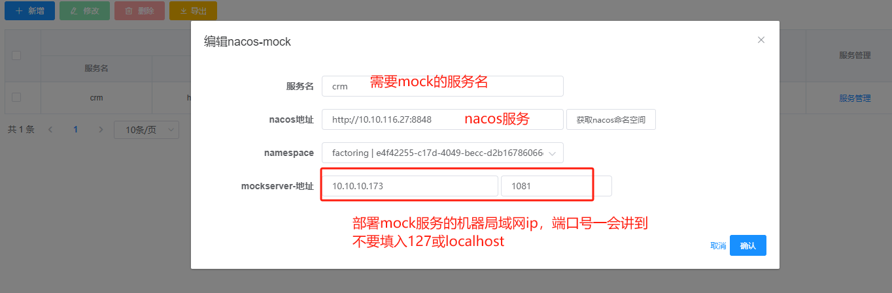

### 场景

基于Nacos服务管理，实现无需更改代码即可进行全局或部分接口的mock。

例如：

- **第三方数据服务**：在测试支付或数据报告查询等服务时，有些接口的测试环境可能并不总是可用，而且需要模拟各种场景以实现全面覆盖。

- **未完成的接口**：一些接口可能尚未完成，但不能影响主线流程，此时需要部分接口的mock。

- **单元测试**：在上下游接口尚未完成时，不希望修改Feign的代码。

  

与开源项目`MockServer`相比，优势包括：

- √更容易上手

- √支持Nacos，实现0代码改动


## 任务进度 (TODO)

- [x] Nacos 服务管理
- [x]  API Mock
- [x]  支持多场景路由（相同 URL，根据逻辑判断，返回不同的 Mock 数据）
- [x]  端口管理（管理 ng）
- [x]  支持请求参数（GET/POST/PATH），可直接插入返回模板
- [x]  支持 XML（参数可以从 POST 中获取，等同于 JSON）
- [ ]  触发回调


## 技术架构图


## 快速开始

```sh
git clone https://gitee.com/zwbsxwt/nacos-mock.git

cd nacos-mock

cd docker

unzip mock-console.zip

docker-compose up -d
```


docker安装方式可参考`常见问题`一栏


## 使用方法

访问`3901`端口,登录即可

admin

123456


**假设需要mock `crm` 服务**


添加mock服务及nacos信息(以下只是示例,请根据实际情况填入)



`端口管理`  配置端口号,这里是通过ng监听不同`端口`分发不同`服务名`


`服务管理`


mock管理


如果需要某些条件才能mock时,需要添加逻辑表达,命中才会返回

采用的是谷歌`aviator`表达式,可自行百度,很好上手


返回报文用的`freemark`,同时也支持将用户参数直接返回(也是从get/post/path三大约定变量直接取)


## 测试

请注意,如果是代码中,直接测试即可,**不需要**改为url形式!!!

请注意,如果是代码中,直接测试即可,**不需要**改为url形式!!!

请注意,如果是代码中,直接测试即可,**不需要**改为url形式!!!


如果是网关,直接拼上服务名即可,这里用`crm`举个例子

例如 (xxx是你gateway的地址)

````
http://xxxx/crm/api/user
````


以下采用url形式测试,只是方便做示例


注意:这里逻辑表达限定了为张三


如果改为其它参数则会匹配不上,比如改为赵六,不符合`get.name=='张三'`限定 , 匹配不上会显示`No match! No forward!`


## 项目结构


## mock-console

后台管理项目,改的eladmin, 感谢大神的开源项目

原始项目地址

```
https://github.com/elunez/eladmin
```


## mock-console-ui

MOCK的UI界面


## mock-server

mockServer服务代码,相对简单,用兴趣同学可以看一看


## 常见问题


优先用docker安装,**原始项目可能有部分数据脚本还未来得及完善**


### docker安装


`windows` 和 `mac`

直接下载安装即可

```
https://www.docker.com/products/docker-desktop/
```


`ubuntu`

```
# 获得管理权限
sudo -i 

# docker
apt update -y 
apt install docker.io -y && \
apt install docker -y 

# 检查版本
docker -v

# docker-compose
git clone https://gitee.com/zwbsxwt/docker-compose.git && \
cd docker-compose && \
mv docker-compose-linux-x86_64 /usr/local/bin/docker-compose && \
chmod +x /usr/local/bin/docker-compose

# 检查版本
docker-compose -v
```


`centos`

```

sudo yum update -y

sudo yum install -y yum-utils device-mapper-persistent-data lvm2

yum-config-manager \
    --add-repo \
    https://mirrors.aliyun.com/docker-ce/linux/centos/docker-ce.repo


sudo yum install -y docker-ce docker-ce-cli containerd.io


sudo systemctl start docker

# 检查版本
docker -v

# docker-compose
git clone https://gitee.com/zwbsxwt/docker-compose.git && \
cd docker-compose && \
mv docker-compose-linux-x86_64 /usr/local/bin/docker-compose && \
chmod +x /usr/local/bin/docker-compose


# 检查版本
docker-compose -v
```


有的同学可能git也不会装

```sh
# windows和mac下载安装即可 (自行百度)

# ubuntu
sudo apt install git -y

# centos 
sudo yum install git -y
```


快速启动

```agsl
git clone https://gitee.com/zwbsxwt/nacos-mock.git

cd docker

unzip mock-console.zip

docker-compose up -d
```


关于method

GET/POST是不同类型的请求,同学不要搞混了,意思就是如果你设定是个POST请求,用GET形式是访问不到的


## 捐赠

开源不易,请作者喝杯咖啡吧


